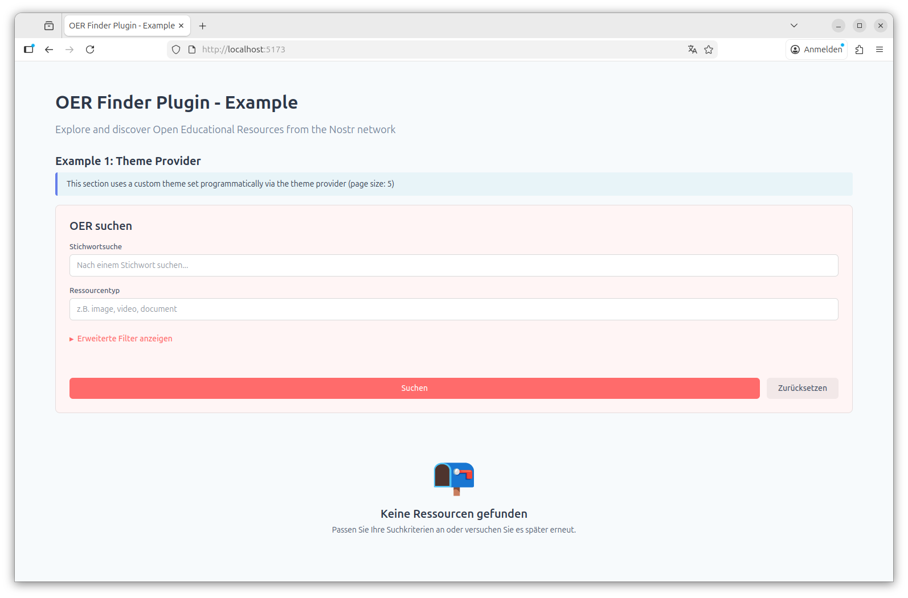
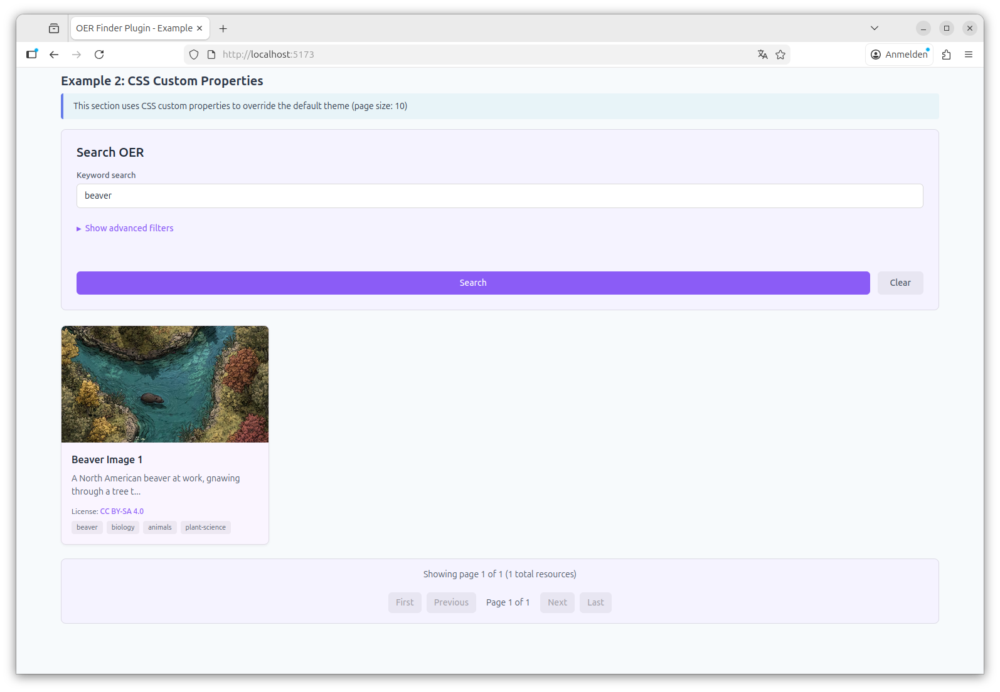

# Nostr OER Finder - Aggregator and Plugin

```
┌─────────────────────────────────────────────────────────────────┐
│                        Your Application                         │
│  ┌───────────────────────┐    ┌───────────────────────────────┐ │
│  │  oer-finder-plugin    │    │   oer-finder-api-client       │ │
│  │  (Web Components)     │    │   (TypeScript Client)         │ │
│  └───────────┬───────────┘    └───────────────┬───────────────┘ │
└──────────────┼────────────────────────────────┼─────────────────┘
               │                                │
               └────────────────┬───────────────┘
                                │ HTTP API
                                ▼
                 ┌──────────────────────────────┐
                 │     Aggregator Server        │
                 │  (NestJS + PostgreSQL)       │
                 └──────────────┬───────────────┘
                                │
       ┌────────────────────────┼────────────────────────┐
       │                        │                        │
       ▼                        ▼                        ▼
┌─────────────────┐   ┌─────────────────┐   ┌─────────────────────┐
│  Nostr Relays   │   │  Source Adapters │   │     imgproxy        │
│ (Event Source)  │   │ (External APIs)  │   │   (Image Proxy)     │
└─────────────────┘   └─────────────────┘   └─────────────────────┘
                              │
              ┌───────────────┼───────────────┐
              │               │               │
              ▼               ▼               ▼
         ┌────────┐     ┌──────────┐    ┌──────────┐
         │ARASAAC │     │ Future   │    │ Future   │
         └────────┘     └──────────┘    └──────────┘
```

An Open Educational Resources (OER) discovery system built on Nostr, providing:

1. **Aggregator Service**: Listens to configurable Nostr relays for OER image resources, collects them, and exposes them via a public API
2. **Source Adapters**: Pluggable adapters for external OER sources (e.g., ARASAAC) that integrate seamlessly with search results
3. **JavaScript Packages**: Type-safe API client and web components for integrating OER resources into applications

## Demo of the configurable Web Components



## Quick Start

### Development Server Setup

```bash
# 1. Build and start services
docker compose build
docker compose up -d --force-recreate

# 2. Configure environment
cp .env.example .env
# Edit .env with your settings

# 3. Initialize database
docker compose exec postgres createdb -U postgres oer-aggregator-dev

# 4. Run the application
pnpm start:dev
```

The API will be available at `http://localhost:3000/api/v1/oer` with interactive documentation at `http://localhost:3000/api-docs`.

**📚 [Full Server Setup Guide](./docs/server-setup.md)** - Detailed installation, configuration, and development instructions

### Production Server Setup

Simply use the already built docker image instead of building it yourself: `docker pull ghcr.io/edufeed-org/oer-finder-plugin`

Docker compose

```yml
services:
  app:
    image: ghcr.io/edufeed-org/oer-finder-plugin
    ...
```

### Using the Client Packages

Please note: This requires a `.npmrc` file in your root folder with the following content:

```
@edufeed-org:registry=https://npm.pkg.github.com
//npm.pkg.github.com/:_authToken=YOUR_GITHUB_TOKEN
```

#### API Client (TypeScript)

```bash
npm install @edufeed-org/oer-finder-api-client
```

```typescript
import { createOerClient } from '@edufeed-org/oer-finder-api-client';

const client = createOerClient('http://localhost:3000');
const { data, error } = await client.GET('/api/v1/oer', {
  params: { query: { page: 1, pageSize: 10 } }
});
```

#### Web Components Plugin

```bash
npm install @edufeed-org/oer-finder-plugin
```

```html
<oer-search api-url="http://localhost:3000"></oer-search>
<oer-list></oer-list>
```

**Customize colors with CSS:**

```html
<style>
  oer-search, oer-list, oer-card {
    --primary-color: #8b5cf6;
    --primary-hover-color: #7c3aed;
    --secondary-color: #ec4899;
  }
</style>

<oer-search api-url="http://localhost:3000"></oer-search>
<oer-list></oer-list>
```

**📚 [Full Client Package Guide](./docs/client-packages.md)** - Installation, usage examples, and API reference

## Documentation

### Getting Started
- **[Server Setup](./docs/server-setup.md)** - Installation, configuration, development, and testing
- **[Client Packages](./docs/client-packages.md)** - API client and web components usage
- **[Client Packages Examples for Angular](./docs/client-packages-angular.md)** - Web components usage in Angular

### Architecture & Design
- **[Architecture](./docs/architecture.md)** - System architecture and database schema
- **[Design Principles](./docs/design.md)** - Design philosophy and requirements
- **[Nostr Events](./docs/nostr-events.md)** - Event types, examples, and processing

## Features

- 🔌 **Multi-Relay Support** - Connect to multiple Nostr relays simultaneously
- 🔍 **Advanced Search** - Filter by license, educational level, audience, and more
- 🔗 **Source Adapters** - Extend search results with external OER sources (ARASAAC, and more)
- 📦 **Type-Safe Client** - Auto-generated TypeScript client from OpenAPI spec
- 🎨 **Web Components** - Ready-to-use UI components built with Lit
- 🗄️ **PostgreSQL Storage** - Efficient querying with indexed fields
- 🔄 **Event Management** - Automatic handling of updates and deletions per Nostr specs
- 🖼️ **Image Proxy Support** - Optional imgproxy integration for CORS handling and thumbnail generation

## API Example

```bash
# Get all OER resources
curl http://localhost:3000/api/v1/oer

# Search by license
curl "http://localhost:3000/api/v1/oer?license=https://creativecommons.org/licenses/by-sa/4.0/"

# Filter by educational level
curl "http://localhost:3000/api/v1/oer?educationalLevel=https://w3id.org/kim/educationalLevel/level_A"
```

## Development

```bash
# Run tests
pnpm test

# Run lints and formatting
pnpm lint
pnpm format

# Type check and build
pnpm build
```

See [Server Setup Guide](./docs/server-setup.md#development) for detailed development instructions.

## License

- MIT
- BSD-3: The oer-finder-plugin makes use of lit, which is licensed under BSD-3
