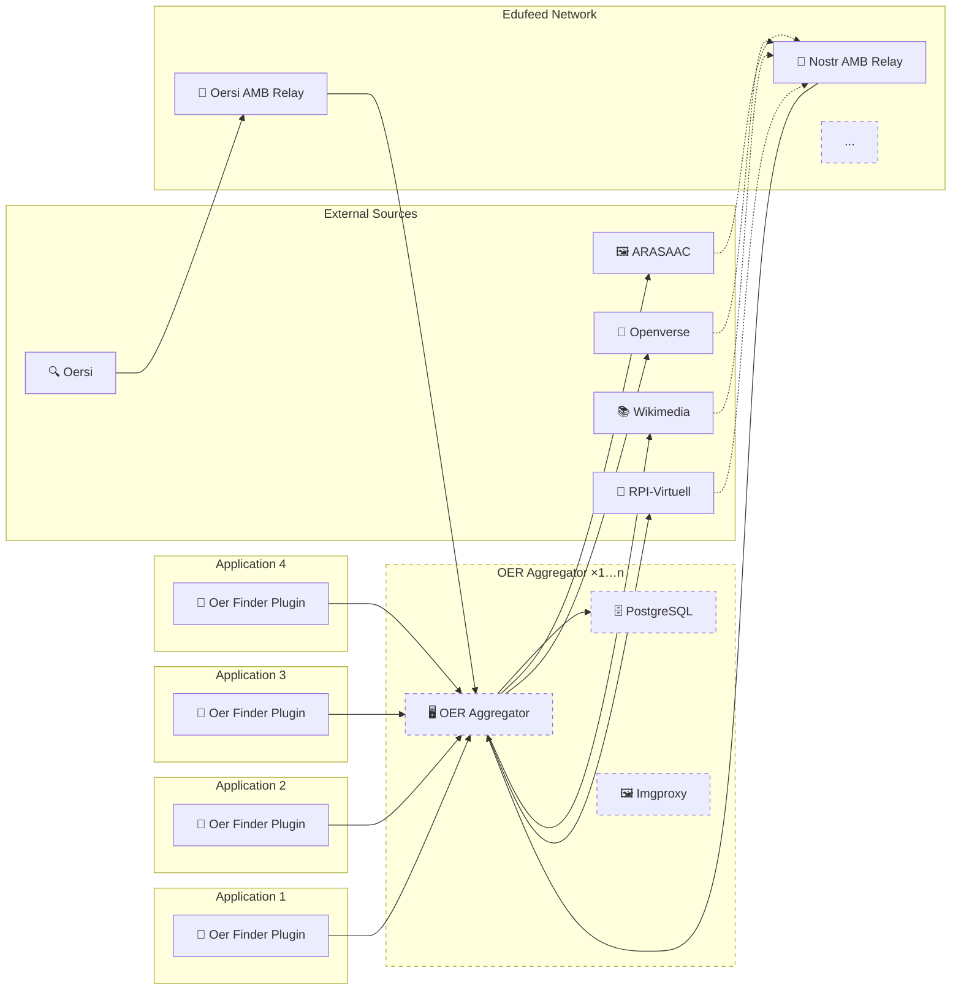

# OER Finder - Aggregator and Plugin

<p align="center">
  
</p>
An Open Educational Resources (OER) discovery system built on Nostr and built on https://dini-ag-kim.github.io/amb/latest , providing:

1. **Aggregator Service**: A NestJS server that listens for Nostr AMB events from configurable relays, stores them in a PostgreSQL database, and serves unified OER results via a public API. Additionally supports external source adapters (Openverse, ARASAAC, RPI-Virtuell, Wikimedia) through an **extendable adapter system** - add your own adapters to integrate any external API.
2. **Source Adapters**: Pluggable adapters for external OER sources (e.g., ARASAAC, Openverse) that integrate seamlessly with search results. The adapter plugin system makes it easy to add new sources.
3. **JavaScript Packages**: Type-safe API client and web components for integrating OER resources into applications
4. **Nostr Event Ingestion**: The aggregator subscribes to AMB Nostr relays via WebSocket, ingests kind 30142 events (and related file/deletion events), and stores them locally in PostgreSQL for fast querying.

**Motivation**: Instead of configuring for each new educational app new OER sources, this project aims to offer a meta search with reusable web components. The idea is to make it as easy as possible to install a OER search component in any Javascript application with multiple sources preconfigured. The main idea started to listen for OER Nostr events. But as this network must be estabilished first, additional sources were introduced.

## Demo of the configurable Web Components

The screenshot shows an example of using Openverse as a OER source for the keyword "car".

## Overview

```mermaid
flowchart LR
    subgraph App1["Application 1"]
        P1["🔌 Oer Finder Plugin"]
    end

    subgraph App2["Application 2"]
        P2["🔌 Oer Finder Plugin"]
    end

    subgraph App3["Application 3"]
        P3["🔌 Oer Finder Plugin"]
    end

    subgraph App4["Application 4"]
        P4["🔌 Oer Finder Plugin"]
    end

    subgraph AggregatorGroup["OER Aggregator ×1…n"]
        AGG["🖥️ OER Aggregator"]
        DB["🗄️ PostgreSQL"]
        IMGPROXY["🖼️ Imgproxy"]
    end

    subgraph Sources["External Sources"]
        S1["🖼️ ARASAAC"]
        S2["🎨 Openverse"]
        S3["📚 Wikimedia"]
        S5["🔍 Oersi"]
        S6["🙏 RPI-Virtuell"]
    end

    subgraph Relay["Edufeed Network"]
        R1["📡 Nostr AMB Relay"]
        R2["..."]
        R3["📡 Oersi AMB Relay"]
    end

    P1 --> AGG
    P2 --> AGG
    P3 --> AGG
    P4 --> AGG

    AGG --> DB
    AGG --> S1
    AGG --> S2
    AGG --> S3
    AGG --> S6

    R1 --> AGG
    R3 --> AGG

    S1 -.-> R1
    S2 -.-> R1
    S3 -.-> R1
    S6 -.-> R1

    S5 --> R3

    style AGG stroke-dasharray: 5 5
    style DB stroke-dasharray: 5 5
    style IMGPROXY stroke-dasharray: 5 5
    style AggregatorGroup stroke-dasharray: 5 5
    style R2 stroke-dasharray: 5 5
```
## Quick Start

### Development Server Setup

```bash
# 1. Build and start services (includes PostgreSQL, AMB relay, Typesense, imgproxy)
docker compose build
docker compose up -d --force-recreate

# 2. Configure environment
cp .env.example .env
# Edit .env with your settings

# 3. Install dependencies
pnpm install

# 4. Run the application
pnpm start:dev
```

> **Note:** This is a pnpm workspace monorepo — the entity, nostr, and adapter packages must be built before the NestJS server can start. The `start:dev` script handles this automatically via `build:packages`. If you need to build packages manually (e.g. before running `pnpm start:prod`), run `pnpm run build:packages` or `pnpm run build` (which builds both packages and the server).

The API will be available at `http://localhost:3000/api/v1/oer` with interactive documentation at `http://localhost:3000/api-docs`.

**[Full Server Setup Guide](./docs/server-setup.md)** - Detailed installation, configuration, and development instructions

### Production Server Setup

Simply use the already built docker image instead of building it yourself: `docker pull ghcr.io/edufeed-org/oer-finder-plugin`

Docker compose

```yml
services:
  app:
    image: ghcr.io/edufeed-org/oer-finder-plugin
    ...
```

### Using the Client Packages

Please note: This requires a `.npmrc` file in your root folder with the following content:

```bash
@edufeed-org:registry=https://npm.pkg.github.com
//npm.pkg.github.com/:_authToken=${GITHUB_TOKEN}
```
Then, configure an env variable `GITHUB_TOKEN`.

#### API Client (TypeScript)

```bash
pnpm add @edufeed-org/oer-finder-api-client
```

```typescript
import { createOerClient } from '@edufeed-org/oer-finder-api-client';

const client = createOerClient('http://localhost:3000');
const { data, error } = await client.GET('/api/v1/oer', {
  params: { query: { source: 'nostr', searchTerm: 'plants' } }
});
```

#### Web Components Plugin

```bash
pnpm add @edufeed-org/oer-finder-plugin
```

```html
<oer-search api-url="http://localhost:3000">
  <oer-list></oer-list>
  <oer-load-more></oer-load-more>
</oer-search>
```

**Customize colors with CSS:**

```html
<style>
  oer-search, oer-list, oer-card, oer-load-more {
    --primary-color: #8b5cf6;
    --primary-hover-color: #7c3aed;
    --secondary-color: #ec4899;
  }
</style>

<oer-search api-url="http://localhost:3000">
  <oer-list></oer-list>
  <oer-load-more></oer-load-more>
</oer-search>
```

**[Full Client Package Guide](./docs/client-packages.md)** - Installation, usage examples, and API reference

## Documentation

### Getting Started
- **[Server Setup](./docs/server-setup.md)** - Installation, configuration, development, and testing
- **[Client Packages](./docs/client-packages.md)** - API client and web components usage
- **[Client Packages Examples for Angular](./docs/client-packages-angular.md)** - Web components usage in Angular
- **[Client Packages Examples for Svelte](./docs/client-packages-svelte.md)** - Web components usage in Svelte
- **[Client Packages Examples for React](./docs/client-packages-react.md)** - React component wrappers usage

### Architecture & Design
- **[Architecture](./docs/architecture.md)** - System architecture and adapter system
- **[Design Principles](./docs/design.md)** - Design philosophy and requirements
- **[Nostr Events](./docs/nostr-events.md)** - AMB event types and format
- **[Creating a New Adapter](./docs/creating-a-new-adapter.md)** - Step-by-step guide for building a new source adapter

## Features

- 🔍 **Meta Search** - Query multiple OER sources through a single API
- 🗄️ **Nostr Ingestion** - Subscribes to AMB relays via WebSocket and stores events in PostgreSQL
- 🔗 **Source Adapters** - Extend search results with external OER sources (ARASAAC, Openverse, RPI-Virtuell, and more)
- 📦 **Type-Safe Client** - Auto-generated TypeScript client from OpenAPI spec
- 🎨 **Web Components** - Ready-to-use UI components built with Lit
- 🛡️ **Privacy-Aware Asset Proxying** (server mode) - Implicitly loaded assets (thumbnails in search results) are proxied via imgproxy or HMAC-signed URL redirects, preventing third-party tracking and CORS issues. Explicit actions like viewing original resources remain in the user's or integrator's domain. In direct-client mode, the browser contacts external sources directly and proxying does not apply.
- 🔒 **Rate Limiting** - Per-IP rate limiting for API protection
- 🔌 **Extensible** - Add custom adapters to integrate any external OER API

## API Example

```bash
# Search OER from the internal Nostr database
curl "http://localhost:3000/api/v1/oer?source=nostr&searchTerm=pythagoras"

# Search from Openverse
curl "http://localhost:3000/api/v1/oer?source=openverse&searchTerm=plants&type=image"

# Search from ARASAAC
curl "http://localhost:3000/api/v1/oer?source=arasaac&searchTerm=car"
```

## Development

### Publishing Demo Events

To populate the local AMB relay with sample OER events for development and testing, use the `nak` (Nostr Army Knife) service:

```bash
docker compose run --rm --entrypoint sh nak /data/publish-demo-events.sh
```

This publishes sample Nostr events (kind 30142 learning resources) to the local AMB relay. The aggregator will automatically ingest these events into the PostgreSQL database when `NOSTR_INGEST_ENABLED=true`.

You can also use `nak` directly to publish a custom kind 30142 learning resource event (the AMB relay only accepts kind 30142 events):

```bash
docker compose run --rm nak event -k 30142 \
  -c "A custom learning resource description" \
  -t "d=my-unique-resource-id" \
  -t "type=LearningResource" \
  -t "name=My Custom Resource" \
  -t "license:id=https://creativecommons.org/licenses/by-sa/4.0/" \
  -t "inLanguage=en" \
  ws://amb-relay:3334
```

To query events from the relay directly:

```bash
docker compose run --rm nak req --search "pythagoras" ws://amb-relay:3334
```

```bash
# Run tests
pnpm test

# Run lints and formatting
pnpm lint
pnpm format

# Type check and build
pnpm build
```

See [Server Setup Guide](./docs/server-setup.md#development) for detailed development instructions.

## Release Process

Before creating a new version on GitHub, don't forget to bump the versions of the client packages. If not changed, the client packages will not get new release candidates. Then, simply create a new release on GitHub.

## License

- MIT
- BSD-3: The oer-finder-plugin makes use of lit, which is licensed under BSD-3

## Example Integrations
- edufeed / kanban-editor: https://github.com/edufeed-org/kanban-editor/pull/38

## Acknowledgements

- **[ARASAAC](https://arasaac.org/)** - Aragonese Portal of Augmentative and Alternative Communication, providing pictograms and resources under Creative Commons license

## Funding
This project is being funded by the BMBSFJ.

Förderkennzeichen: 01PZ25003


