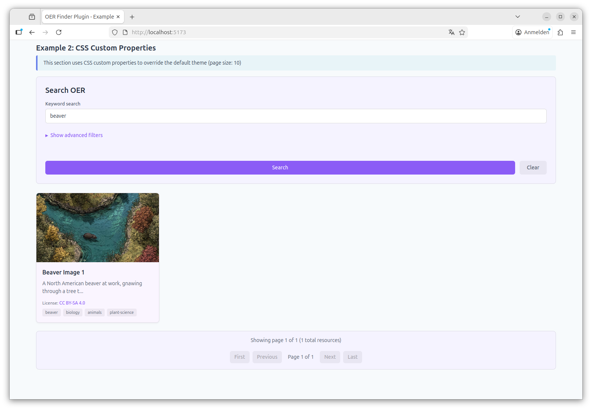
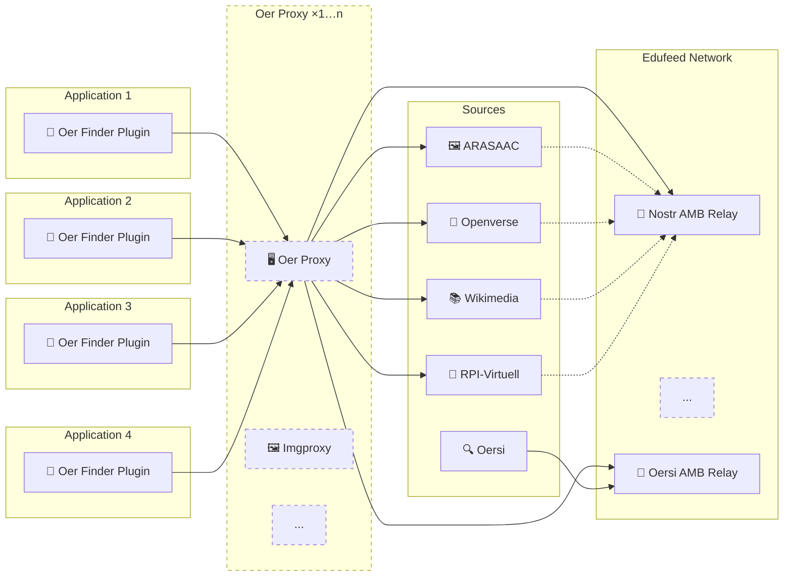

# Nostr OER Finder - Proxy and Plugin

<p align="center">
  
</p>
An Open Educational Resources (OER) discovery system built on Nostr and built on https://dini-ag-kim.github.io/amb/latest , providing:

1. **Proxy Service**: Forwards search queries to configurable source adapters and returns unified OER results via a public API. Supports searching an AMB Nostr relay, Openverse, ARASAAC, RPI-Virtuell, and more through an **extendable adapter system** - add your own adapters to integrate any external API.
2. **Source Adapters**: Pluggable adapters for OER sources (e.g., AMB relay, ARASAAC, Openverse) that integrate seamlessly with search results. The adapter plugin system makes it easy to add new sources.
3. **JavaScript Packages**: Type-safe API client and web components for integrating OER resources into applications
4. **Aggregation of Nostr Events though Nostr AMB Relay**: The Aggregation of events is done in a separate [AMB Relay based on TypeSense](https://github.com/edufeed-org/amb-relay) that is integrated via a before mentioned adapter.

**Motivation**: Instead of configuring for each new educational app new OER sources, this project aims to offer a meta search with reusable web components. The idea is to make it as easy as possible to install a OER search component in any Javascript application with multiple sources preconfigured. The main idea started to listen for OER Nostr events. But as this network must be estabilished first, additional sources were introduced.

## Demo of the configurable Web Components

The screenshot shows an example of using Openverse as a OER source for the keyword "car".

## Overview

```mermaid
flowchart LR
    subgraph App1["Application 1"]
        P1["🔌 Oer Finder Plugin"]
    end

    subgraph App2["Application 2"]
        P2["🔌 Oer Finder Plugin"]
    end

    subgraph App3["Application 3"]
        P3["🔌 Oer Finder Plugin"]
    end

    subgraph App4["Application 4"]
        P4["🔌 Oer Finder Plugin"]
    end

    subgraph ProxyGroup["Oer Proxy ×1…n"]
        PROXY["🖥️ Oer Proxy"]
        IMGPROXY["🖼️ Imgproxy"]
        PROXY2["..."]
    end

    subgraph Sources["Sources"]
        S1["🖼️ ARASAAC"]
        S2["🎨 Openverse"]
        S3["📚 Wikimedia"]
        S5["🔍 Oersi"]
        S6["🙏 RPI-Virtuell"]
    end

    subgraph Relay["Edufeed Network"]
        R1["📡 Nostr AMB Relay"]
        R2["..."]
        R3["📡 Oersi AMB Relay"]
    end

    P1 --> PROXY
    P2 --> PROXY
    P3 --> PROXY
    P4 --> PROXY

    PROXY --> S1
    PROXY --> S2
    PROXY --> S3
    PROXY --> S6

    PROXY --> R1
    PROXY --> R3

    S1 -.-> R1
    S2 -.-> R1
    S3 -.-> R1
    S6 -.-> R1

    S5 --> R3

    style PROXY stroke-dasharray: 5 5
    style IMGPROXY stroke-dasharray: 5 5
    style PROXY2 stroke-dasharray: 5 5
    style R2 stroke-dasharray: 5 5
    style ProxyGroup stroke-dasharray: 5 5
```
## Quick Start

### Development Setup (Docker Compose)

The `docker-compose.yml` starts all required services for local development: the proxy app, an AMB relay, Typesense, and imgproxy.

```bash
# 1. Configure environment
cp .env.example .env
# Edit .env with your settings (see Server Setup Guide for all variables)

# 2. Build and start all services (includes the proxy server in dev mode)
docker compose build
docker compose up -d --force-recreate
```

The `app` service automatically installs dependencies, builds adapter packages, and starts the NestJS server in watch mode. The API will be available at `http://localhost:3000/api/v1/oer` with interactive documentation at `http://localhost:3000/api-docs`.

**Docker Compose services:**

| Service | Description | Port |
|---------|-------------|------|
| `app` | OER Proxy (development target, auto-rebuilds) | 3000 |
| `amb-relay` | Nostr AMB Relay (WebSocket) | 3334 |
| `typesense` | Typesense search engine (used by amb-relay) | 8108 |
| `imgproxy` | Image proxy for thumbnail generation | 8080 |
| `nak` | Nostr Army Knife CLI for test events (tools profile) | — |

To customize the Docker Compose setup (e.g. override build context or volumes), create or edit `docker-compose.override.yml` — Docker Compose merges it automatically.

> **Note:** This is a pnpm workspace monorepo — the adapter packages must be built before the NestJS server can start. The Docker Compose `app` service handles this automatically. If you prefer to run the server outside Docker, use `pnpm install && pnpm start:dev` (which also builds packages automatically). For production mode, run `pnpm run build` first.

**[Full Server Setup Guide](./docs/server-setup.md)** - Detailed configuration, environment variables, asset proxying, and development instructions

#### Running the Plugin Example

To try the web components plugin locally (served via Vite on port 5173):

```bash
pnpm install
pnpm run start:dev:plugin-example
```

This starts a standalone example app from `packages/oer-finder-plugin-example/` that demonstrates the `<oer-search>`, `<oer-list>`, and `<oer-load-more>` components. Make sure the proxy server is running (via Docker Compose or `pnpm start:dev`) so the plugin can connect to the API.

### Production Setup (Docker)

Use the pre-built Docker image — no need to build locally:

```bash
docker pull ghcr.io/edufeed-org/oer-finder-plugin
```

Example `docker-compose.yml` for production:

```yml
services:
  app:
    image: ghcr.io/edufeed-org/oer-finder-plugin
    ports:
      - "3000:3000"
    environment:
      NODE_ENV: production
      ENABLED_ADAPTERS: nostr-amb-relay,arasaac,openverse
      NOSTR_AMB_RELAY_URL: ws://amb-relay:3334
      # Configure asset proxying for production (see Server Setup Guide)
      # IMGPROXY_BASE_URL: http://imgproxy:8080
      # ASSET_PROXY_ALLOWED_DOMAINS: arasaac.org,upload.wikimedia.org
      # CORS_ALLOWED_ORIGINS: https://your-app.example.com
      # TRUST_PROXY: 1
```

See the **[Server Setup Guide](./docs/server-setup.md)** for the full list of environment variables, security recommendations, and asset proxying configuration.

### Using the Client Packages

The project provides TypeScript client packages (API client, web components, React wrappers) for integrating OER search into your application.

**[Full Client Package Guide](./docs/client-packages.md)** - Registry setup, installation, usage examples, and API reference

## Documentation

### Getting Started
- **[Server Setup](./docs/server-setup.md)** - Installation, configuration, development, and testing
- **[Client Packages](./docs/client-packages.md)** - API client and web components usage
- **[Client Packages Examples for Angular](./docs/client-packages-angular.md)** - Web components usage in Angular
- **[Client Packages Examples for Svelte](./docs/client-packages-svelte.md)** - Web components usage in Svelte
- **[Client Packages Examples for React](./docs/client-packages-react.md)** - React component wrappers usage

### Architecture & Design
- **[Architecture](./docs/architecture.md)** - System architecture and adapter system
- **[Design Principles](./docs/design.md)** - Design philosophy and requirements
- **[Nostr Events](./docs/nostr-events.md)** - AMB event types and format
- **[Creating a New Adapter](./docs/creating-a-new-adapter.md)** - Step-by-step guide for building a new source adapter

## Features

- 🔍 **Meta Search** - Query multiple OER sources through a single API
- 🔗 **Source Adapters** - Extend search results with external OER sources (AMB relay, ARASAAC, Openverse, RPI-Virtuell, and more)
- 📦 **Type-Safe Client** - Auto-generated TypeScript client from OpenAPI spec
- 🎨 **Web Components** - Ready-to-use UI components built with Lit
- 🛡️ **Privacy-Aware Asset Proxying** (server-proxy mode) - Implicitly loaded assets (thumbnails in search results) are proxied via imgproxy or HMAC-signed URL redirects, preventing third-party tracking and CORS issues. Explicit actions like viewing original resources remain in the user's or integrator's domain. In direct-client mode, the browser contacts external sources directly and proxying does not apply.
- 🔒 **Rate Limiting** - Per-IP rate limiting for API protection
- 🔌 **Extensible** - Add custom adapters to integrate any external OER API

> **Security Note — Nostr AMB Relay adapter:** If you plan to use the `nostr-amb-relay` adapter, it is recommended to use it in **direct-client mode** (browser-side) only. If you need to use it through the proxy server, configure **imgproxy** and set `ASSET_PROXY_ALLOWED_DOMAINS` to restrict which domains the proxy may contact. AMB relay events can contain arbitrary URLs; when the proxy fetches these server-side, a malicious event could point to internal network resources (SSRF). See the [Server Setup Guide](./docs/server-setup.md#nostr-amb-relay-security) for details.

## API Example

```bash
# Search OER from AMB relay
curl "http://localhost:3000/api/v1/oer?source=nostr-amb-relay&searchTerm=pythagoras"

# Search from Openverse
curl "http://localhost:3000/api/v1/oer?source=openverse&searchTerm=plants&type=image"

# Search from ARASAAC
curl "http://localhost:3000/api/v1/oer?source=arasaac&searchTerm=car"
```

## Development

### Publishing Demo Events

To populate the local AMB relay with sample OER events for development and testing, use the `nak` (Nostr Army Knife) service:

```bash
docker compose run --rm --entrypoint sh nak /data/publish-demo-events.sh
```

This publishes sample Nostr events (kind 30142 learning resources) to the local AMB relay. The events will then be available for the proxy to search via the nostr-amb-relay adapter.

You can also use `nak` directly to publish a custom kind 30142 learning resource event (the AMB relay only accepts kind 30142 events):

```bash
docker compose run --rm nak event -k 30142 \
  -c "A custom learning resource description" \
  -t "d=my-unique-resource-id" \
  -t "type=LearningResource" \
  -t "name=My Custom Resource" \
  -t "license:id=https://creativecommons.org/licenses/by-sa/4.0/" \
  -t "inLanguage=en" \
  ws://amb-relay:3334
```

To query events from the relay directly:

```bash
docker compose run --rm nak req --search "pythagoras" ws://amb-relay:3334
```

### Other useful dev commands

```bash
# Run tests
pnpm test

# Run lints and formatting
pnpm lint
pnpm format

# Type check and build
pnpm build
```

See [Server Setup Guide](./docs/server-setup.md#development) for detailed development instructions.

## Release Process

Before creating a new version on GitHub, don't forget to bump the versions of the client packages. If not changed, the client packages will not get new release candidates. Then, simply create a new release on GitHub.

## License

- MIT
- BSD-3: The oer-finder-plugin makes use of lit, which is licensed under BSD-3

## Example Integrations
- edufeed / kanban-editor: https://github.com/edufeed-org/kanban-editor
- b310 / teammapper: https://github.com/b310-digital/teammapper/pull/1081
- b310 / groupwriter: https://github.com/b310-digital/groupwriter/pull/75

## Acknowledgements

- **[ARASAAC](https://arasaac.org/)** - Aragonese Portal of Augmentative and Alternative Communication, providing pictograms and resources under Creative Commons license

## Funding
This project is being funded by the BMBSFJ.

Förderkennzeichen: 01PZ25003


