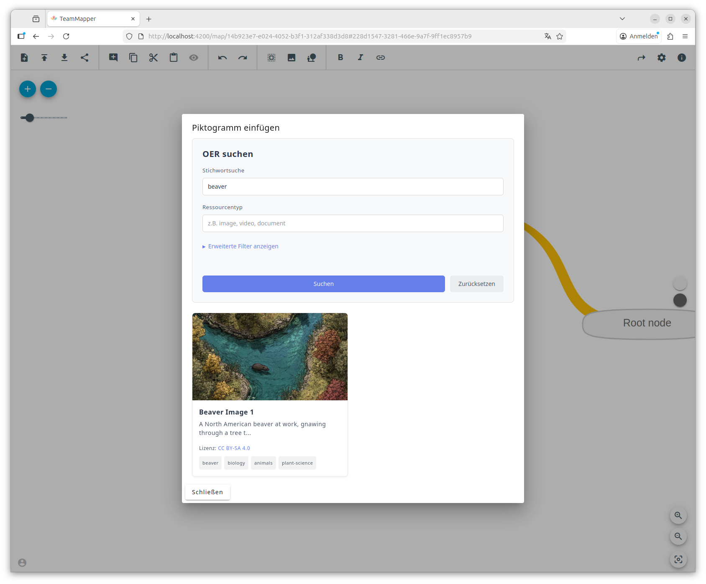

# Using OER Finder Plugin in Angular

This guide covers Angular-specific integration. For component properties, events, available adapters, key types, and operating modes, see [Client Packages](./client-packages.md).

## Installation

Ensure the GitHub package registry is configured (see [Registry Setup](./client-packages.md#registry-setup)), then install the web components plugin:

```bash
pnpm add @edufeed-org/oer-finder-plugin
```

For additional installation details (pnpm overrides, etc.), see [Client Packages — Web Components Plugin](./client-packages.md#web-components-plugin).

## Angular Configuration

Angular requires `CUSTOM_ELEMENTS_SCHEMA` to recognize web component tags.

**Standalone component (Angular 14+, recommended):**

```typescript
import { Component, CUSTOM_ELEMENTS_SCHEMA } from '@angular/core';

@Component({
  selector: 'app-oer-finder',
  standalone: true,
  schemas: [CUSTOM_ELEMENTS_SCHEMA],
  templateUrl: './oer-finder.component.html',
})
export class OerFinderComponent { /* ... */ }
```

**NgModule-based component:**

```typescript
import { NgModule, CUSTOM_ELEMENTS_SCHEMA } from '@angular/core';

@NgModule({
  declarations: [OerFinderComponent],
  schemas: [CUSTOM_ELEMENTS_SCHEMA],
})
export class OerFinderModule {}
```

## Basic Usage (Server-Proxy Mode)

The recommended pattern is to slot `<oer-list>` and `<oer-load-more>` inside `<oer-search>`. Use `@ViewChild` with `ElementRef` to access the underlying web component elements. For the full list of component properties and events, see [Component Properties](./client-packages.md#component-properties).

### Component

```typescript
import { Component, ElementRef, ViewChild, AfterViewInit } from '@angular/core';
import type {
  OerSearchResultEvent,
  OerCardClickEvent,
  OerSearchElement,
  SourceConfig,
} from '@edufeed-org/oer-finder-plugin';
import '@edufeed-org/oer-finder-plugin';

@Component({
  selector: 'app-oer-finder',
  templateUrl: './oer-finder.component.html',
})
export class OerFinderComponent implements AfterViewInit {
  @ViewChild('searchElement') searchElement!: ElementRef;
  @ViewChild('listElement') listElement!: ElementRef;
  @ViewChild('loadMoreElement') loadMoreElement!: ElementRef;

  // Configure available sources (checked: true sets the pre-selected sources)
  sources: SourceConfig[] = [
    { id: 'nostr-amb-relay', label: 'Nostr AMB Relay', checked: true },
    { id: 'openverse', label: 'Openverse' },
    { id: 'arasaac', label: 'ARASAAC' },
    { id: 'rpi-virtuell', label: 'RPI-Virtuell' },
    { id: 'wikimedia', label: 'Wikimedia Commons' },
  ];

  ngAfterViewInit(): void {
    // Set sources as a JS property (not HTML attribute)
    const searchEl = this.searchElement.nativeElement as OerSearchElement;
    searchEl.sources = this.sources;
  }

  // Note: load-more events bubble up and are automatically
  // caught by oer-search to fetch the next page of results.

  onSearchLoading(): void {
    const listEl = this.listElement.nativeElement;
    const loadMoreEl = this.loadMoreElement.nativeElement;
    listEl.loading = true;
    loadMoreEl.loading = true;
  }

  onSearchResults(event: Event): void {
    const { data, meta } = (event as OerSearchResultEvent).detail;
    const listEl = this.listElement.nativeElement;
    const loadMoreEl = this.loadMoreElement.nativeElement;
    listEl.oers = data;
    listEl.loading = false;
    loadMoreEl.metadata = meta;
    loadMoreEl.loading = false;
  }

  onSearchError(event: Event): void {
    const { error } = (event as CustomEvent<{ error: string }>).detail;
    const listEl = this.listElement.nativeElement;
    const loadMoreEl = this.loadMoreElement.nativeElement;
    listEl.oers = [];
    listEl.error = error;
    listEl.loading = false;
    loadMoreEl.metadata = null;
    loadMoreEl.loading = false;
  }

  onSearchCleared(): void {
    const listEl = this.listElement.nativeElement;
    const loadMoreEl = this.loadMoreElement.nativeElement;
    listEl.oers = [];
    listEl.error = null;
    listEl.loading = false;
    loadMoreEl.metadata = null;
    loadMoreEl.loading = false;
  }

  onCardClick(event: Event): void {
    const { oer } = (event as OerCardClickEvent).detail;
    const url = oer.amb?.id;
    if (url) {
      window.open(String(url), '_blank', 'noopener,noreferrer');
    }
  }
}
```

### Template

Angular uses `(event-name)="handler($event)"` syntax for web component events:

```html
<oer-search
  #searchElement
  api-url="https://your-api-url.com"
  language="en"
  page-size="20"
  (search-loading)="onSearchLoading()"
  (search-results)="onSearchResults($event)"
  (search-error)="onSearchError($event)"
  (search-cleared)="onSearchCleared()"
>
  <oer-list
    #listElement
    language="en"
    (card-click)="onCardClick($event)"
  ></oer-list>
  <oer-load-more
    #loadMoreElement
    language="en"
  ></oer-load-more>
</oer-search>
```

## Direct Client Mode Example

The component code is identical to the [server-proxy example above](#basic-usage-server-proxy-mode) with two differences: adapters must be registered at startup, and the `api-url` attribute is omitted. For adapter details, see [Available Adapters](./client-packages.md#available-adapters).

**1. Register adapters once at your app entry point (e.g., `main.ts`):**

```typescript
import { registerAllBuiltInAdapters } from '@edufeed-org/oer-finder-plugin/adapters';
registerAllBuiltInAdapters();
```

**2. Provide `baseUrl` in the source config where required:**

```typescript
sources: SourceConfig[] = [
  { id: 'openverse', label: 'Openverse', checked: true },
  { id: 'arasaac', label: 'ARASAAC' },
  { id: 'wikimedia', label: 'Wikimedia Commons' },
  { id: 'nostr-amb-relay', label: 'Nostr AMB Relay', baseUrl: 'wss://amb-relay.edufeed.org' },
  { id: 'rpi-virtuell', label: 'RPI-Virtuell' },
];
```

**3. Remove `api-url` from the template:**

```html
<oer-search
  #searchElement
  language="en"
  page-size="20"
  (search-loading)="onSearchLoading()"
  (search-results)="onSearchResults($event)"
  (search-error)="onSearchError($event)"
  (search-cleared)="onSearchCleared()"
>
  <oer-list #listElement language="en" (card-click)="onCardClick($event)"></oer-list>
  <oer-load-more #loadMoreElement language="en"></oer-load-more>
</oer-search>
```

All event handlers and component logic remain the same.

## Example

See the [TeamMapper integration PR](https://github.com/b310-digital/teammapper/pull/1081) for a real-world Angular example.


